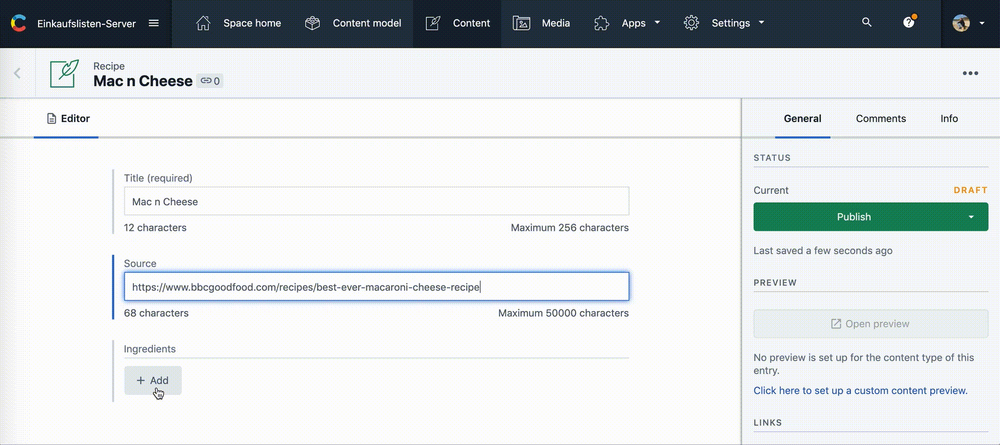

# Contentful Ingredients Field App

This [Contentful App](https://www.contentful.com/developers/docs/extensibility/app-framework/) adds a custom UI that can be used on top of the [JSON Object](https://www.contentful.com/developers/docs/concepts/data-model/) field type and represents a list of ingredients for recipes.



Inspired by [this video](https://www.youtube.com/watch?v=OtmV3TPTbRs) and bootstrapped with [Create Contentful App](https://github.com/contentful/create-contentful-app).

## Data structure

The data produced by the ingredients field type looks like this:

```json
[
    {
        "amount": "2 tbsp",
        "id": "4skkkYCvbdHVhRfI5hdW7o"
    },
    {
        "amount": "3 tsp",
        "id": "2xFnDNGBloZzp59kddJBI6"
    },
    {
        "amount": "200g",
        "id": "2uqKK4iWHxhlRrGn24OLvy"
    }
]
```

`id` represents a relation to an entry of a collection named `"ingredients"`.

`amount` is an unformatted string holding information about how much to use of the referenced ingredient.

## Development

In the project directory, you can run:

#### `npm start`

Creates or updates your app definition in contentful, and runs the app in development mode.
Open your app to view it in the browser.

The page will reload if you make edits.
You will also see any lint errors in the console.

#### `npm run build`

Builds the app for production to the `build` folder.
It correctly bundles React in production mode and optimizes the build for the best performance.

The build is minified and the filenames include the hashes.
Your app is ready to be deployed!

## More about Contentful Apps

[Read more](https://www.contentful.com/developers/docs/extensibility/app-framework/create-contentful-app/) and check out the video on how to use the CLI.

Create Contentful App uses [Create React App](https://create-react-app.dev/). You can learn more in the [Create React App documentation](https://facebook.github.io/create-react-app/docs/getting-started) and how to further customize your app.
